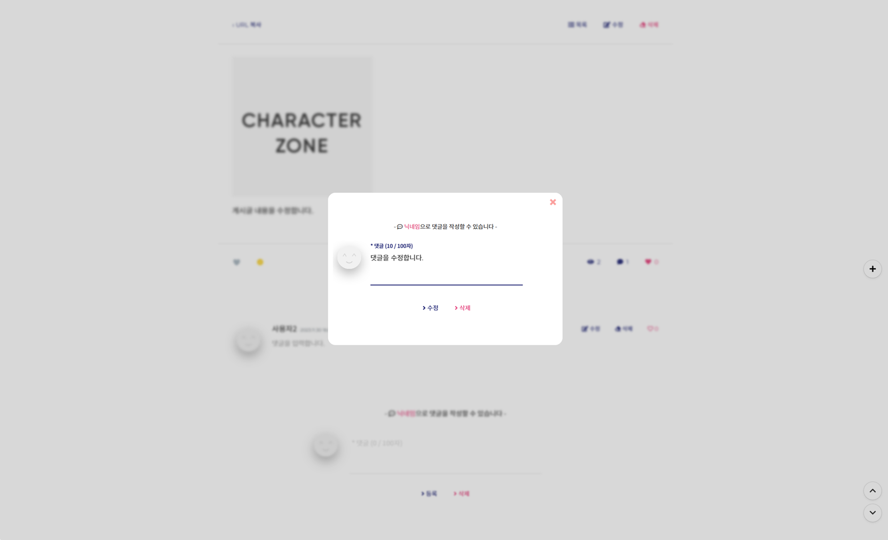

<div align="center">
  <h1>커뮤니티 웹 애플리케이션</h1>
</div>

<div align="center">
  
  
  
  
  <br>
  
  
  
  
  
</div>
<br>

<div align="left">
  <h2>1. 개발 환경</h2>

- <p><b>OS: </b>Windows (10, 64 Bit)</p>
- <p><b>DB: </b>Maria DB</p>
- <p><b>IDE: </b>IntelliJ</p>
</div>
<br>

<div align="left">
  <h2>2. 실행 화면</h2>




</div>
<br>

<div align="left">
  <h2>3. 프로젝트 구조</h2>

  ```
  *
  ├─ app.community.model/**: DTO 클래스
  ├─ app.community.mapper/**: SQL 매핑 클래스
  ├─ app.community.controller/**: 컨트롤러 클래스
  ├─ app.community.configuration/**: 공통 설정 클래스
  ├─ app.community.security/**: 로그인 관련 클래스
  ├─ app.community.service/**: 서비스 클래스
  ├─ app.community.utility/**: 유틸리티 클래스
  │
  ├─ src/resources/**: SQL 매핑 파일 및 데이터 파일
  └─ src/webapp/**: 웹 페이지 파일(JSP, CSS, JS)
  ```
</div>
<br>

<div align="left">
  <h2>4. 구현 기능</h2>

#### 1) 회원
- 회원 가입, 로그인/로그아웃
#### 2-1) 게시판 (게시글)
- 게시글 CRUD, WYSIWYG 에디터 연동, 검색 + 페이징 처리

  ```
  검색 처리: WHERE ${검색 옵션} LIKE CONCAT ('%', #{검색 단어}, '%')
  검색 + 페이징 처리: 검색 WHERE절 + LIMIT #{criteria.시작 번호}, #{criteria.페이지당 게시글 개수}
  ```
#### 2-2) 게시판 (댓글)
- 댓글 CRUD (jQuery/Ajax 통신 사용)
#### 2-3) 게시판 (추천)
- 게시글 및 댓글 추천과 추천 취소 (jQuery/Ajax 통신 사용)
#### 3-1) 채팅 (채팅방)
- 채팅방 CRUD
#### 3-2) 채팅 (채팅방 메시지)
- 채팅방 메시지 전송/수신 (웹소켓 통신 사용)
</div>
<br>